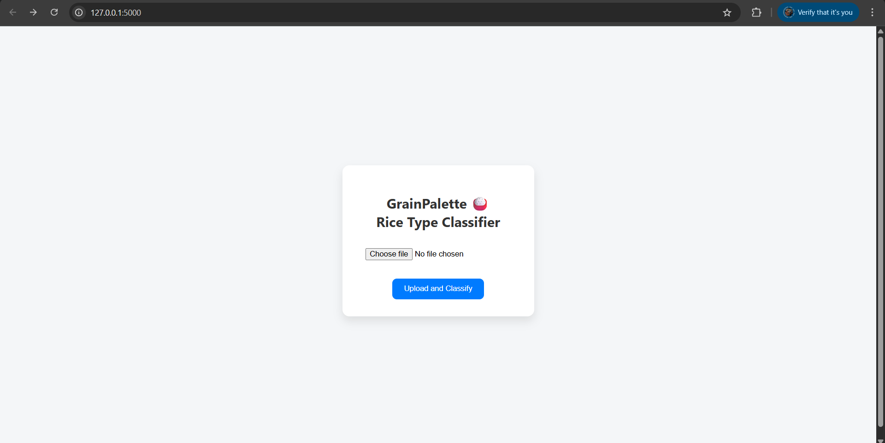

# 🌾 GrainPalette - Rice Type Classifier

A Deep Learning project for classifying rice types using image recognition and transfer learning, built with **TensorFlow**, **Keras**, and deployed using **Flask**.

## 📸 Demo

**🔗 Live Preview (Localhost):** `http://127.0.0.1:5000`

---

## 🚀 Features

- Classifies rice images into 5 types:
  - Basmati
  - Jasmine
  - Arborio
  - Ipsala
  - Karacadag
- Built with transfer learning using pre-trained CNNs.
- User-friendly web interface using Flask.
- Supports `.jpg`, `.png`, `.jpeg` rice grain images.

---

## 🧠 Tech Stack

| Technology   | Use Case                  |
|--------------|---------------------------|
| Python       | Core programming language |
| TensorFlow/Keras | Model training, prediction |
| Flask        | Web framework             |
| HTML/CSS     | Frontend design           |
| NumPy        | Image processing          |

---

## 🗂 Project Structure

GrainPalette/
│
├── rice_dataset/ # Image dataset
├── static/ # Uploaded images
├── templates/
│ └── index.html # Frontend HTML file
│
├── rice_model.h5 # Trained model
├── app.py # Flask backend
├── requirements.txt # Python dependencies
└── README.md 

## 🎥 Project Demo

Here is a demonstration of our project **GrainPalette**:

▶️ [Watch the Demo Video](https://drive.google.com/file/d/1YD1ZODBOgqSLtat_FuMgRscHJrDMI512/view?usp=drive_link)

This video explains:

- Team members
- Running the Flask app
- Uploading image and rice type prediction demo

